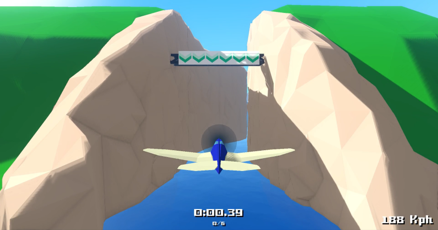
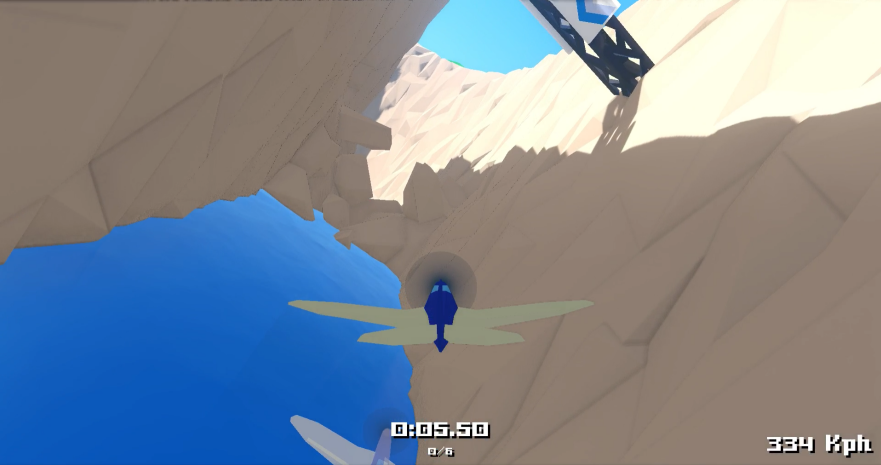

# Reckless Wings: Wild Gust
It is a flight simulation racing game made with [Godot](https://godotengine.org/).

## The ideas

The game combines two main concepts:
 * Piloting a light aircraft with high speed and controllability, like we can find in some flight simulators.
 * Racing in challenging maps, trying to find the perfect trajectory to beat your best time again and again (like in the awesome $free [TrackMania Nation](http://trackmaniaforever.com/)).

## Easy to take off but hard to master!

**The physic of flight is simplified...** to enjoy the game even if you are not a profesionnal pilot.
**...but not too much** to introduce difficulties for the most skillful players.

## Preview

Watch the video:

Screenshots:

